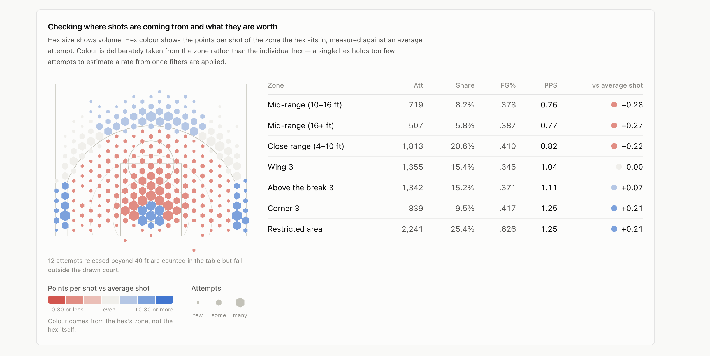
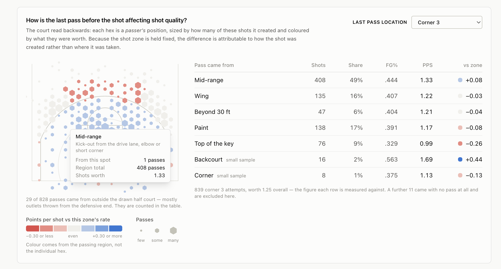
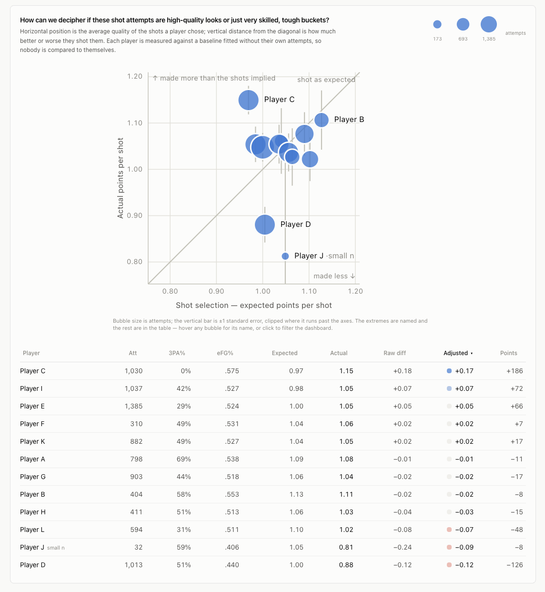
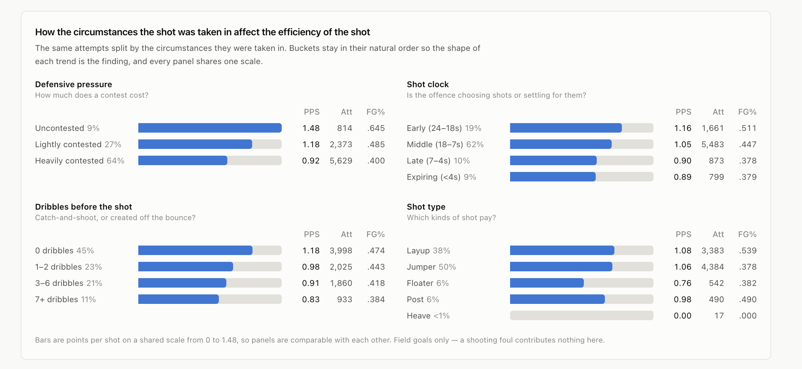
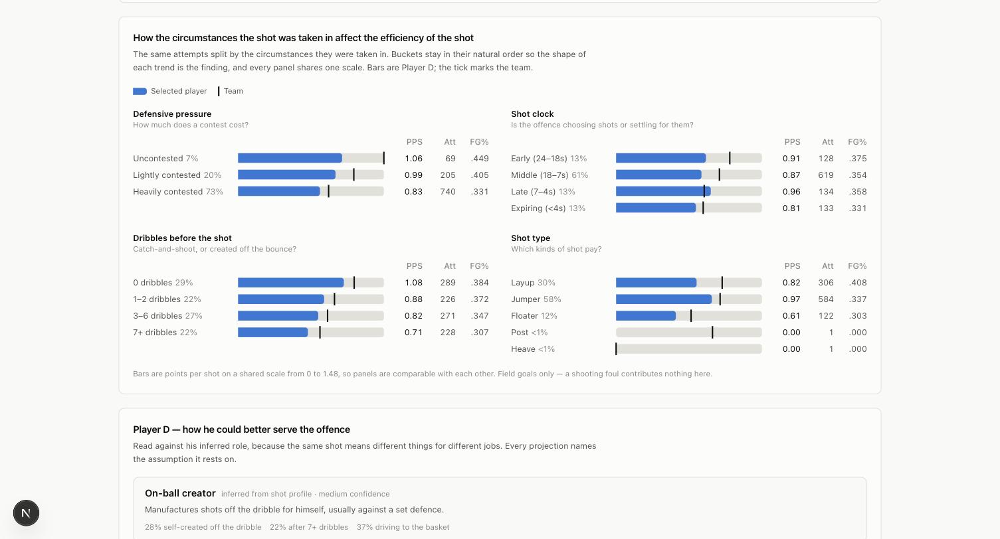
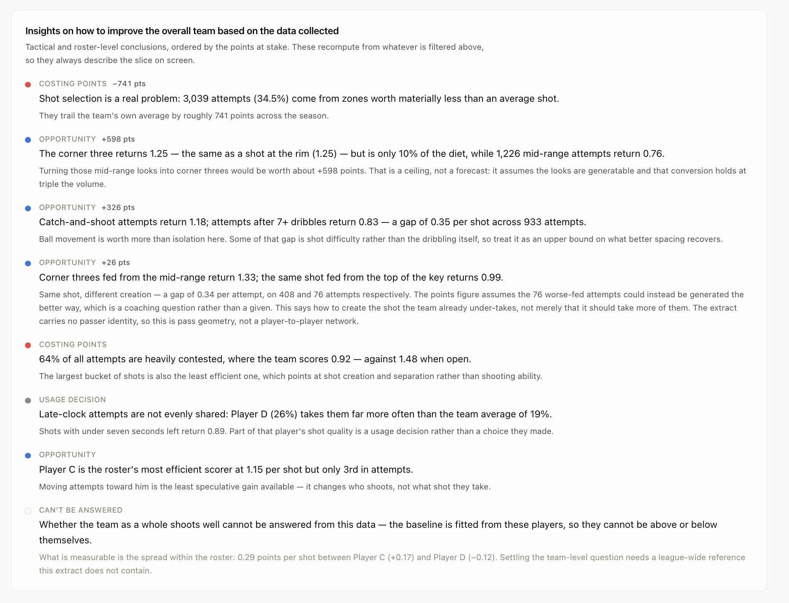
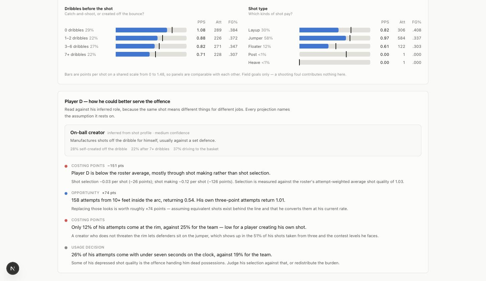
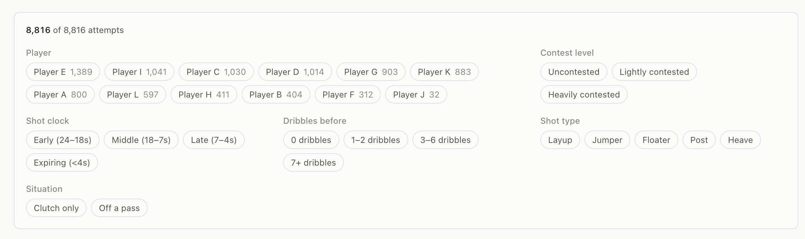
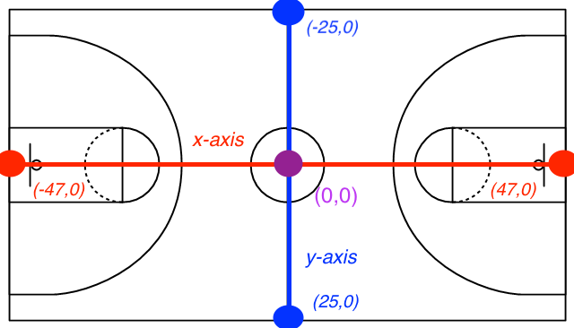

# Shot Profile Dashboard

Here is the question I tried to answer based on the option of questions given in the prompt.

> **Is the team's efficiency gap a shot selection problem or a shot making problem? Determine which is true for each player, and give 
> them insights/recommendations based off the data we collected. **

This stems from the 2 original questions in the prompt of What shots are inefficient and efficient? & What tactical or roster-level insights can be derived from the data?

---

## Running it locally

```bash
npm install
npm run dev          # http://localhost:3000
```

### Deployed site

https://colin-wallace-kings-project.vercel.app/

---

## Tech stack

| Layer | Choice | Why |
|---|---|---|
| Framework | **Next.js 16** (App Router), React 19, TypeScript | Static output; the App Router gives a clean client/server split even though this ships as a single static page |
| Styling | **Tailwind 4** | Design tokens as CSS custom properties; no component library needed at this size |
| Charts | **Hand-rolled SVG** + `d3-scale` for scales only | No library draws a basketball court, and once the court is hand-built the scatter and bars are cheaper to hand-build than to bend a library into shape |
| Validation | **Zod** | One schema that defines what "clean" means, enforced at build time |
| Tests | **Vitest** | 189 tests; the analytics layer is pure functions, so it needs no DOM |
| Data | Build-time ETL → static JSON | See below |

**Deliberately not used:** no state library (the URL is the state), no charting
library, no component library, no API layer, no database. Each was considered; each
would have added surface without answering the question better.

---

## Dashboard Features

### 1. Checking where shots are coming from and what they are worth



A hex map over a to-scale half court, with a zone table beside it ordered
worst-first.

**Hex size encodes volume. Hex colour encodes the efficiency of the hex's zone —
not the hex's own make rate.** This is the most important decision in the project
and it is deliberate. Colouring each hex by its own percentage is the conventional
approach and it is wrong at this sample size: filter to one player and one context
and the median hex holds around ten attempts, so the map would render sampling
noise in confident reds and blues. Binning by zone keeps every colour backed by
hundreds of attempts while hexes still show *where* shots come from.

Measured on this dataset, at a 3 ft hex radius:

| Slice | Cells | Median attempts/cell | Cells with n ≥ 30 |
|---|---|---|---|
| Whole team (8,808) | 82 | 58 | 52 |
| One player (1,389) | 72 | 10 | 12 |
| One player + one context filter (740) | 61 | 11 | 4 |

The bottom row is an ordinary UI state. Four trustworthy cells out of sixty-one is
not a chart.

### 2. How is the last pass before the shot affecting shot quality?



The court read backwards: each hex is a **passer's** position, sized by how many of
the selected shots it created and coloured by what those shots were worth. Pick the
shot zone to trace back from; the default is the corner three.

**This is not an assist network, and cannot be.** The extract carries `passer_x`
and `passer_y` but no passer *identity*, so who passed to whom is unrecoverable.
Attributing passes to players by matching origins against each player's operating
areas was considered and rejected — it would produce a named network that reads as
fact with no way to validate it.

What *is* recoverable is the geometry, and holding the shot zone fixed controls for
location, so the difference is attributable to how the shot was created:

| Corner threes, by where the pass came from | Attempts | PPS |
|---|---|---|
| Mid-range (the drive/post kick-out band) | 408 | **1.33** |
| Wing | 135 | 1.22 |
| Paint | 138 | 1.17 |
| Top of the key | 76 | **0.99** |

A corner three created by a kick-out from inside the arc is worth **0.34 more per
attempt** than the same shot swung from the top of the key — and kick-outs create
half of them. This says *how* to generate the shot the team already under-takes,
not merely that it should take more of them.

Two more the view surfaces:

- **The paint kick-out helps the corner but hurts the wing** — 1.17 to the corner,
  0.81 to the wing. Not every kick-out is equal.
- **A null result, reported anyway:** paint drive-and-kick threes go at 1.10
  against 1.12 for all other passed threes. The classic action is not producing
  better threes here.

### 3. How can we decipher if these shot attempts are high-quality looks or just very skilled, tough buckets?



Expected points per shot on x, actual on y, with the diagonal as "converted at the
expected rate". Horizontal position answers *are these good shots?*; distance from
the diagonal answers *does the player make them?*

Each player is graded against a baseline fitted **without their own attempts**.
Without that, the highest-volume shooter is partly compared to themselves, which
flattens exactly the differences the view exists to show.

The table below it is sortable, and the default sort is the sample-size-adjusted
difference. Sorting by the raw difference instead drops the 32-attempt player to
last place — which makes the case for shrinkage visible in one click instead of
asking the reader to trust a footnote.


### 4. How the circumstances the shot was taken in affect the efficiency of the shot



The same attempts split by defensive pressure, shot clock, dribbles before the
shot, and shot type. Buckets stay in their natural order — never sorted by value —
because the question is whether the trend is monotonic, and sorting by efficiency
would answer it before the reader looks. All four decline monotonically here.

Selecting a player draws the team as a tick per bucket, so the comparison is
per-situation rather than a single season number:



### 5. Insights on how to improve the overall team based on the data collected



The synthesis, placed last so it reads as a conclusion drawn from the three views
above rather than an assertion made ahead of them. Bullets are **generated by
rules, not written as prose** — each one recomputes from whatever is filtered, so
the conclusions always describe the slice on screen, and each carries the
arithmetic that produced it. Where a bullet projects a gain, it names the
assumption that projection rests on.

Selecting a player switches it to that player's role and what he could do
differently:



**Roles are inferred, not assigned.** The dataset has no position, height, or
minutes column and the players are anonymised, so a positional label would have to
be invented. The behavioural archetype is derived from the shot profile instead —
which is the more useful quantity anyway, since it describes the role a player
actually performed rather than the one his listed position implies, and it
re-derives when the data is filtered.

| Player | Inferred role | Confidence | Driven by |
|---|---|---|---|
| C | Rim finisher | high | 58% of attempts finished off a teammate's play, 50% at the rim, 0% after 7+ dribbles |
| A | Movement shooter | medium | 39% shooting on the move, 69% from three, 15% at the rim |
| B, G, H, J | Floor spacer | high (J: low) | 32–44% stationary catch-and-shoot, 59–77% taken without a dribble |
| E, D, I, F | On-ball creator | high/medium | 24–40% self-created off the dribble, 11–24% after 7+ dribbles |
| L | Rim finisher / Floor spacer | medium | 43% at the rim *and* 31% from three — genuinely both |
| K | On-ball creator / Floor spacer | medium | creates off the dribble *and* spots up |

Bullets are typed, and the types carry meaning:

- **Costing points** / **Opportunity** — things the player or team controls
- **Usage decision** — things the *coach* controls. Player D takes 26% of his
  shots with under seven seconds left against a team average of 19%; part of his
  depressed shot quality is the offence handing him dead possessions, not a
  discipline problem.
- **Can't be answered** — stated rather than assumed away

### Cross-cutting



One filter row scopes every view — player, contest level, shot clock, dribbles,
shot type, clutch, and off-a-pass. Filter state lives in the URL, so any view is a
shareable link and the back button steps through changes.

Selecting a player does something slightly different in each view, on purpose:

The scatter is the exception because filtering a twelve-player comparison down to
one player leaves nothing to compare — and would strip the baseline of the players
it needs to be a baseline at all.

---

## Assumptions

**The rim is at (−41.75, 0), not (−47, 0).** The data dictionary marks the baseline
at x = −47, but the hoop sits 5.25 ft inside it. Anchoring to the baseline would
inflate every shot distance by more than five feet and misclassify entire zones.
Sanity check: the median layup in the data lands at (−40.4, −0.2).



*The coordinate system as supplied. Note that it marks the baselines, not the rims
— which is exactly the trap above.*

**Points per shot excludes free throws, and this understates rim pressure.** The
dataset has no free-throw data, but 875 attempts (9.9%) drew a shooting foul and
666 of those were fouled misses — worth roughly two free throws each in reality. The
foul rate varies enormously by player (Player C 12.0%, Player A 2.8%), so this is
not a uniform offset. The dashboard surfaces the foul rate as a headline stat rather
than burying the caveat. **This is the single biggest limitation of the analysis.**

**The baseline is fitted from these twelve players, not the league.** No league-wide
reference was provided, so "above expectation" means "compared with how this team
shoots these shots". That is the right question for comparing teammates and the
wrong one for judging the team in absolute terms.

**`catch_and_shoot` is exactly `dribbles_before === 0`** in all 8,816 rows. The
column carries no additional information, so it is dropped after validation — but
the schema asserts the equality, so a future extract that breaks it fails the build
rather than silently invalidating a chart.

**`passer_x`/`passer_y` are the last pass before the shot, not an assist marker.**
5,392 *unassisted* shots have passer coordinates. A further 838 rows have the
literal string `NULL` — no pass at all, including 209 of the 212 tip-ins, which
makes sense since a putback off a rebound has no passer. These decode to `null`
rather than 0, which would place a phantom passer at centre court.

**Passers are routinely out of bounds.** 85 passes come from behind the baseline and
144 from past a sideline (every inbounds pass is thrown from out of bounds), so
passer coordinates are validated with much looser tolerance than shooter ones.

**Heaves and backcourt releases are excluded from the model.** 17 heaves (0-for-17)
and 8 backcourt attempts are artefacts of an expiring clock, not shot-selection
decisions; including them would penalise whoever happened to be holding the ball.
They remain in the totals and are disclosed on the map.

**Role archetypes are inferred from behaviour, and the weights are judgment.**
There are no role labels in the data to fit against, so the classifier's weights
were chosen so each archetype leans on the signals that distinguish it rather than
on shares many roles have in common. Its job is to separate twelve players cleanly
and to admit when it cannot — not to be precise about a truth nobody can check.
Two of the twelve come back as hybrids, which is the correct answer for them.

**Every projected gain is a counterfactual.** "Reallocating these 158 attempts is
worth +74 points" assumes the replacement looks are actually generatable, that the
player converts them at his demonstrated rate on much higher volume, and that
defences do not adjust. All three are strong. The assumption is printed next to the
number rather than buried, and the team-level version is labelled a ceiling rather
than a forecast.

**Pass origins are geometry, not attribution.** `passer_x`/`passer_y` give a
position, never an identity, so every claim in the pass-origin view is about where
a pass came from and never about who threw it. Origin regions use the same court
geometry as the shot zones so the two cannot drift apart.

**Clutch is time-only.** Period 4+ with under five minutes remaining. Score margin
is part of the usual definition and is not in this dataset.

**Left/right is assumed.** `y < 0` is treated as the offence's left. The axes are
fixed by the dictionary but not which sideline is which; nothing downstream depends
on it, and flipping is a one-line change in `zones.ts`.

---

## Tradeoffs

**Zones over per-hex colouring.** Covered above — the sample-size table is the
argument. The cost is that a genuinely hot spot *within* a zone is invisible.

**Materiality band on "below average".** Classifying zones by the sign of the
difference put the wing three — 0.005 PPS under the team average, a rounding
error — into the problem bucket, reporting 49.8% of attempts as below average
instead of 34.5%. A 0.05 PPS band now separates "worse" from "indistinguishable".
Without it the dashboard's headline claim would be overstated by nearly half.

**Shrinkage changes the ranking, on purpose.** Differences are pulled toward zero by
`n / (n + 50)`. Both raw and adjusted figures are shown, because a coach should see
the estimate *and* how much of it survives accounting for sample size.

**Two sample-size thresholds, not one.** 25 attempts is enough to plot a zone cell;
rating a player's season needs 100. A single threshold called a 32-attempt player
"reliable".

**Client-side aggregation.** 8,816 rows is nothing for a modern browser, filters feel
instant, and an API here would add latency and deployment surface to something that
works without it. This is the decision most sensitive to scale — see below.

**Selective labels on the scatter.** A scatter is an "all-pairs" form where any two
marks can end up adjacent, and twelve mutually distinguishable hues do not exist
under colour-vision deficiency. So identity comes from labels, not colour — and
labelling all twelve pushed the seven clustered players' labels so far from their
marks that the leader lines became unreadable. Only the extremes, small samples, and
the hovered or selected player are named.

**No free-throw modelling.** An adjusted PPS that credited ~1.5 points per shooting
foul would be more accurate but would invent a number the data does not contain.
Surfacing the foul rate honestly beat estimating it.

**Insights as rules, not prose.** Hand-written conclusions would read better and
would be wrong the moment anyone touched a filter. Rules recompute against the
current slice, carry their own arithmetic, and are unit-testable — at the cost of
phrasing that is occasionally stiffer than an analyst would write. The verdict
sentence is the one place this was worth extra care: an early version compared only
magnitudes and described a player whose selection was +0.07 and making −0.08 as
having the two "contribute roughly equally", when the entire point is that they
pull in opposite directions.

**Roles inferred, not overridable.** An override file was considered and rejected:
correcting the inference would mean using the same numbers the inference already
used, which is circular, and the alternative — hardcoding assumed positions — would
import claims the data cannot support. If this ran against a real roster, positions
and coach-designated roles would be joined in and the inference would become a
cross-check rather than the source of truth.

**Known dependency advisories.** `npm audit` reports 12 high-severity advisories,
all transitive through the ESLint toolchain and Next's build chain (minimatch,
postcss, sharp). All are build/dev-time only — none ship to the browser in a static
export — and force-fixing them breaks the toolchain, so they are left in place.

## Future Improvements

1. **Play and possession context** — see [the section below](https://github.com/CWall-Creations/Sac-Kings-SE-Project#the-biggest-thing-missing-why-the-shot-was-taken). The largest single improvement available, and the only one that would change conclusions rather than sharpen them.
2. **Free-throw-adjusted efficiency as a toggle**, if free-throw data can be joined. The largest improvement available from data of the kind already here.
3. **Passer identity**, if it can be joined from another source. The pass-origin view shows where the last pass came from; with identities it would show who creates them, which is the question a front office actually asks.
4. **Game-level trend** — 160 game dates are in the data; nothing currently uses time. Cold streaks and in-season changes in shot diet are invisible today.
5. **Lineup and opponent context**, neither of which is in this extract.
6. **A defended-shot model** using contest level plus distance, rather than treating contest level as three discrete buckets.


---

## If the dataset were much larger

### The biggest thing missing: why the shot was taken

Everything in this dashboard describes **what** a shot was — where it came from, how
contested it was, how many dribbles preceded it. Nothing in it describes **why the
shot happened**. That is the single largest gap in the analysis, and closing it would
change conclusions rather than merely refine them.

Every shot in an NBA game is either something the offence intended or something it
settled for. A designed pin-down for your best shooter and a bail-out with three
seconds left can produce *identical* rows in this dataset: same zone, same contest
level, same dribble count. The model treats them as the same shot. A coach never
would.

### What the data would look like

Four fields would carry most of the value:

| Field | Example values | What it answers |
|---|---|---|
| `possession_type` | set play, transition, secondary break, scramble, ATO, SLOB/BLOB, offensive rebound | Was there a plan at all? |
| `play_call` | Horns flare, Spain PnR, Floppy, Zoom, Iso, post split | Which plan? |
| `option_rank` | 1st read, 2nd read, counter, improvised | Was this the plan, or what was left of it? |
| `action_completed` | did the entry pass / screen / cut happen as designed | Did the plan actually run? |

### Why it changes the model rather than decorating it

The expected-points baseline currently conditions on zone and contest level. Both are
*descriptions of the shot*. Neither is a description of **intent**, and intent is what
separates a player's decision from a coach's.

That matters because of where the residual goes. Today the arithmetic is:

```
actual = shot selection + shot making
```

Anything the model cannot see is silently absorbed into "shot making", which is why
that term should really be read as *shot making plus everything we failed to measure*.
With play context the decomposition becomes:

```
actual = play design + execution + shot selection + shot making
```

— and the four terms have four different owners. Play design belongs to the coaching
staff. Execution belongs to the group running it. Selection belongs to the shooter's
judgment. Only the last is what most people mean when they say a player is a good or
bad shooter.

Concretely: this dashboard currently reports that Player D cost roughly 126 points
against expectation, 83% of it shot making. It also reports, separately, that 26% of
his attempts come with under seven seconds on the clock against a team average of 19%.
Those two findings are almost certainly related, and the model cannot connect them. If
those late attempts are third reads on possessions that already broke down, the honest
statement is not "Player D shoots badly" — it is "this offence generates a few hundred
dead possessions a season and hands them to Player D." Those call for completely
different interventions, and the current data cannot distinguish them.

### What it would unlock

- **An option-rank efficiency curve.** Points per shot for 1st reads, 2nd reads,
  counters, and scrambles. It will decline; the *slope* is the interesting part,
  because it measures how gracefully the offence degrades when the first look is
  taken away. A flat curve means deep, layered actions. A cliff means one-read plays.
- **First-option rate by player.** The dashboard already flags that Player C is the
  roster's most efficient scorer but only third in attempts. Whether he is a designed
  first option on 40% of sets or 10% turns that from an observation into an
  instruction — and tells you whether the fix is play-calling or personnel.
- **Play-call efficiency, using the machinery already here.** The selection-versus-
  making split applies one level up: which called actions are run often but produce
  little, and which are efficient but underused. Exactly the corner-three argument,
  aimed at the playbook instead of the shot chart.
- **Where the good shots actually come from.** The pass-origin view shows that corner
  threes fed from the mid-range return 1.33 against 0.99 fed from the top. It cannot
  say *which play* generates that kick-out. Play data closes that loop and turns the
  finding into something a staff can call.
- **ATO efficiency** — points per possession out of timeouts, one of the few direct,
  isolatable measures of coaching-staff contribution, and something front offices
  track for exactly that reason.
- **A much stronger role classifier.** Roles are currently inferred from shot profile
  because the extract has no positions. "First option on 40% of half-court sets" is a
  far better description of a player's job than anything derivable from where he
  shoots from.

It also slots into structure the app already has. The insights layer distinguishes a
`concern` (something the player controls) from an `assignment` (something the coach
controls), and that distinction is presently supported by one proxy — late-clock
share. Play context is what would let that category carry real weight.

---
