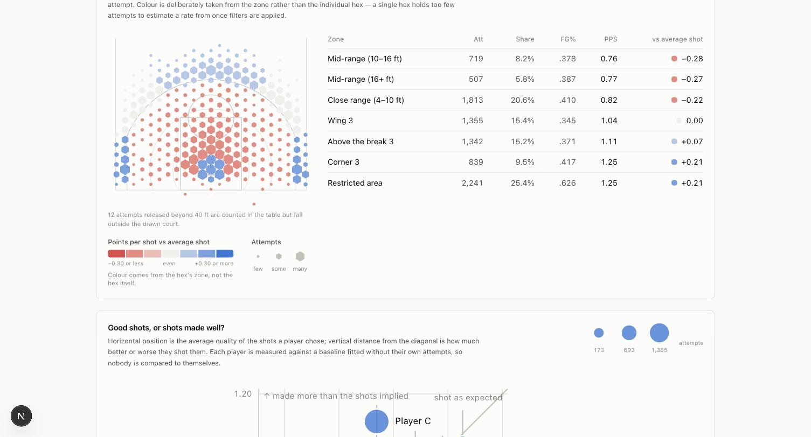
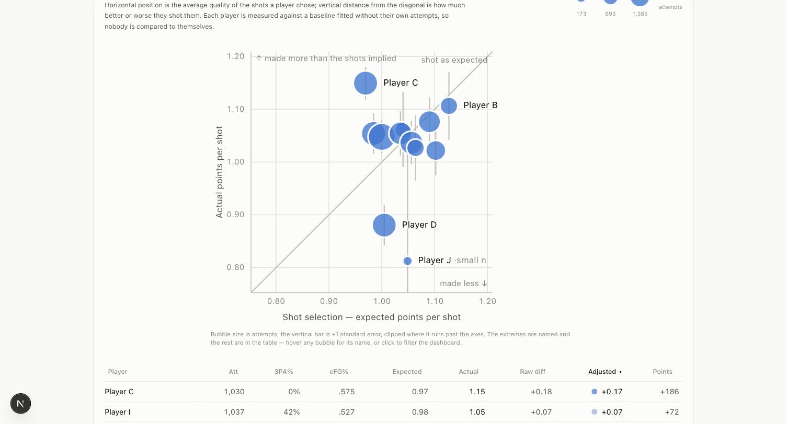
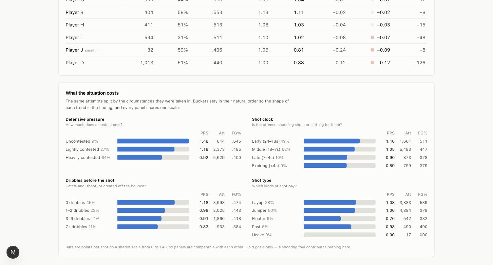
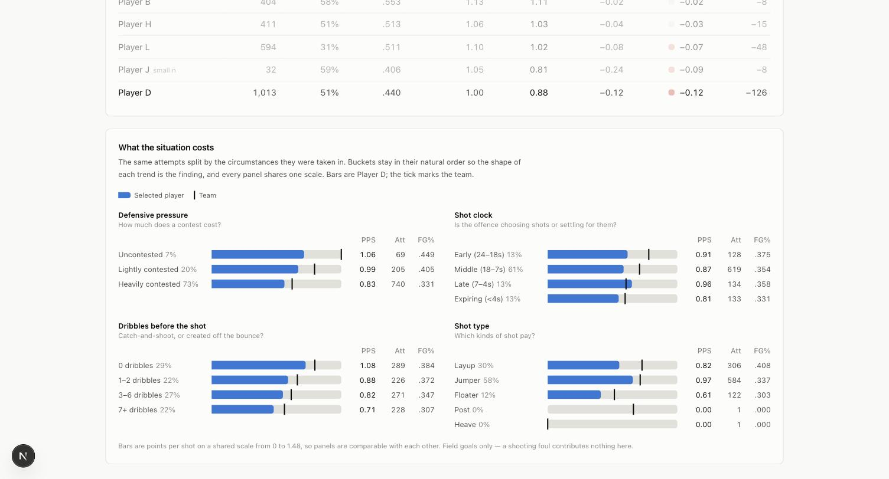
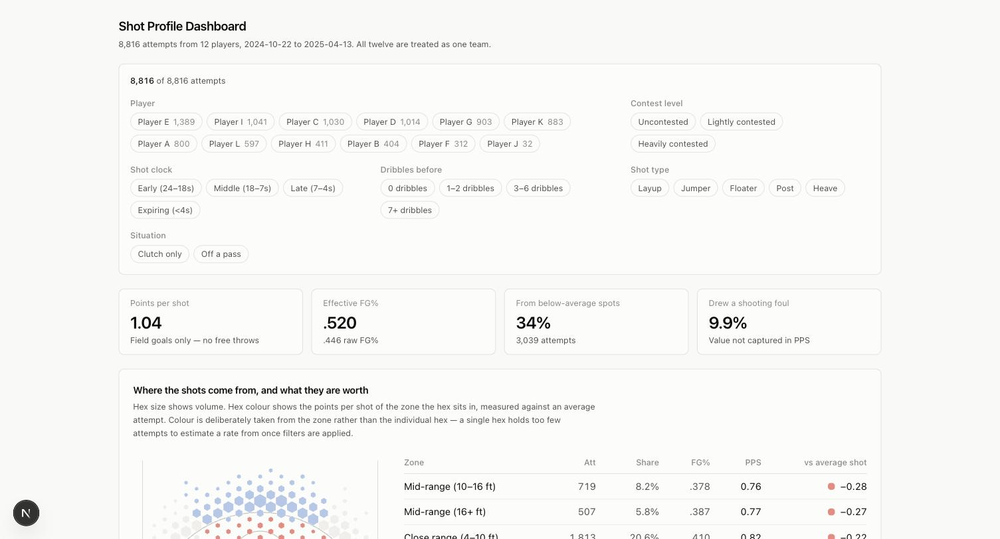

# Shot Profile Dashboard

A shot profile dashboard for twelve anonymised NBA players from the 2024–25 regular
season, treated as one team. 8,816 attempts, 2024-10-22 to 2025-04-13.

The brief offers five possible questions. This dashboard answers one of them
properly rather than all of them thinly:

> **Which shots are efficient or inefficient — and when a shot underperforms, is it
> because it was a bad shot, or because it was missed?**

That framing is the spine of the whole app. Every view separates **shot selection**
(the quality of the attempts a player generates) from **shot making** (whether they
convert them), because a single efficiency number silently averages the two
together and a coach can only act on them separately.

---

## Running it locally

```bash
npm install
npm run dev          # http://localhost:3000
```

`npm run dev` regenerates the dataset before starting, so there is no separate
setup step. Node 20+ (developed on 22).

| Script | What it does |
|---|---|
| `npm run dev` | Regenerate data, then start the dev server |
| `npm run build` | Regenerate data, then build (fully static output) |
| `npm test` | 137 unit and integration tests |
| `npm run data` | Run the ETL only: `data/raw/shots.csv` → `public/data/shots.json` |
| `npm run lint` | ESLint |

### Deploying

`npm run build` produces a fully static site (`○ /` prerendered), so it deploys to
any static host with no configuration — Vercel, Netlify, or GitHub Pages. On Vercel
the repo works as-is: the `prebuild` hook regenerates the dataset, and there are no
environment variables or server runtime to configure.

---

## What it shows

### 1. Where the shots come from, and what they are worth



A hex map over a to-scale half court, with a zone table beside it ordered
worst-first.

**Hex size encodes volume. Hex colour encodes the efficiency of the hex's zone —
not the hex's own make rate.** This is the most important decision in the project
and it is deliberate. Colouring each hex by its own percentage is the conventional
approach and it is wrong at this sample size: filter to one player and one context
and the median hex holds around ten attempts, so the map would render sampling
noise in confident reds and blues. Binning by zone keeps every colour backed by
hundreds of attempts while hexes still show *where* shots come from.

Measured on this dataset, at a 3 ft hex radius:

| Slice | Cells | Median attempts/cell | Cells with n ≥ 30 |
|---|---|---|---|
| Whole team (8,808) | 82 | 58 | 52 |
| One player (1,389) | 72 | 10 | 12 |
| One player + one context filter (740) | 61 | 11 | 4 |

The bottom row is an ordinary UI state. Four trustworthy cells out of sixty-one is
not a chart.

### 2. Good shots, or shots made well?



Expected points per shot on x, actual on y, with the diagonal as "converted at the
expected rate". Horizontal position answers *are these good shots?*; distance from
the diagonal answers *does the player make them?*

Each player is graded against a baseline fitted **without their own attempts**.
Without that, the highest-volume shooter is partly compared to themselves, which
flattens exactly the differences the view exists to show.

The table below it is sortable, and the default sort is the sample-size-adjusted
difference. Sorting by the raw difference instead drops the 32-attempt player to
last place — which makes the case for shrinkage visible in one click instead of
asking the reader to trust a footnote.

### 3. What the situation costs



The same attempts split by defensive pressure, shot clock, dribbles before the
shot, and shot type. Buckets stay in their natural order — never sorted by value —
because the question is whether the trend is monotonic, and sorting by efficiency
would answer it before the reader looks. All four decline monotonically here.

Selecting a player draws the team as a tick per bucket, so the comparison is
per-situation rather than a single season number:



### Cross-cutting



One filter row scopes every view — player, contest level, shot clock, dribbles,
shot type, clutch, and off-a-pass. Filter state lives in the URL, so any view is a
shareable link and the back button steps through changes.

Selecting a player does something slightly different in each view, on purpose:

| View | Effect of selecting a player |
|---|---|
| Shot map | Filters to them, and switches the colour reference from "an average attempt" to "the team in this zone" |
| Selection vs making | **Emphasises** them; the others stay for context |
| Context breakdown | Filters to them and draws the team as a benchmark tick |

The scatter is the exception because filtering a twelve-player comparison down to
one player leaves nothing to compare — and would strip the baseline of the players
it needs to be a baseline at all.

---

## What the data says

Verified numbers, reproducible from `npm test`.

**Team:** 1.041 points per shot, .446 FG%, .520 eFG%, 40.1% of attempts from three.

### The headline

| Zone | Attempts | Share | FG% | PPS |
|---|---|---|---|---|
| Restricted area | 2,241 | 25.4% | .626 | **1.25** |
| Corner 3 | 839 | 9.5% | .417 | **1.25** |
| Above the break 3 | 1,342 | 15.2% | .371 | 1.11 |
| Wing 3 | 1,355 | 15.4% | .345 | 1.04 |
| Close range (4–10 ft) | 1,813 | 20.6% | .410 | **0.82** |
| Mid-range (16+ ft) | 507 | 5.8% | .387 | **0.77** |
| Mid-range (10–16 ft) | 719 | 8.2% | .378 | **0.76** |

**34.5% of this team's attempts (3,039 shots) come from zones worth materially less
than an average attempt, costing roughly 741 points against their own average.**
Meanwhile the corner three is worth exactly as much as a shot at the rim — 1.25 —
and makes up 9.5% of the diet.

### Context

Every situational dimension declines monotonically:

| Dimension | Best → worst |
|---|---|
| Defensive pressure | 1.48 → 1.18 → **0.92** (and 64% of all attempts are heavily contested) |
| Shot clock | 1.16 → 1.05 → 0.90 → 0.89 |
| Dribbles before | **1.18** (0 dribbles) → 0.98 → 0.91 → **0.83** (7+) |

Catch-and-shoot is worth 0.35 more points per shot than a seven-plus-dribble
attempt. That is a roster-construction argument, not just a per-player one.

### Players

| Player | Att | 3PA% | Expected | Actual | Raw diff | Adjusted | Points |
|---|---|---|---|---|---|---|---|
| Player C | 1,030 | 0% | 0.97 | 1.15 | +0.18 | **+0.17** | **+186** |
| Player I | 1,037 | 42% | 0.98 | 1.05 | +0.07 | +0.07 | +72 |
| Player E | 1,385 | 29% | 1.00 | 1.05 | +0.05 | +0.05 | +66 |
| Player L | 594 | 31% | 1.10 | 1.02 | −0.08 | −0.07 | −48 |
| Player J | 32 | 59% | 1.05 | 0.81 | −0.24 | **−0.09** | −8 |
| Player D | 1,013 | 51% | 1.00 | 0.88 | −0.12 | **−0.12** | **−126** |

Two readings worth pulling out:

- **Player C takes the lowest-quality shots on the roster (0.97) and is by far its
  most efficient scorer (1.15).** 73% of his attempts are heavily contested and 50%
  come at the rim: the model rates his shots as hard because they are, and he makes
  them anyway. He is not someone to move off his diet.
- **Player D is the mirror image at comparable volume**: average shot quality,
  well below-average conversion, −126 points. The problem is making, not selection —
  a different intervention entirely from Player L, who takes good shots (1.10) and
  misses them.
- **Player J is the reason shrinkage exists.** Raw, he is the worst shooter on the
  team by a distance; his standard error is ±0.22, wider than the entire spread of
  everyone else. Adjusted, he is unremarkable.

---

## Tech stack

| Layer | Choice | Why |
|---|---|---|
| Framework | **Next.js 16** (App Router), React 19, TypeScript | Static output; the App Router gives a clean client/server split even though this ships as a single static page |
| Styling | **Tailwind 4** | Design tokens as CSS custom properties; no component library needed at this size |
| Charts | **Hand-rolled SVG** + `d3-scale` for scales only | No library draws a basketball court, and once the court is hand-built the scatter and bars are cheaper to hand-build than to bend a library into shape |
| Validation | **Zod** | One schema that defines what "clean" means, enforced at build time |
| Tests | **Vitest** | 137 tests; the analytics layer is pure functions, so it needs no DOM |
| Data | Build-time ETL → static JSON | See below |

**Deliberately not used:** no state library (the URL is the state), no charting
library, no component library, no API layer, no database. Each was considered; each
would have added surface without answering the question better.

### Project structure

```
data/raw/shots.csv            The provided extract, committed so the build is reproducible
scripts/build-data.ts         ETL: validate → enrich → emit public/data/shots.json

src/lib/
  data/       schema.ts, types.ts, enrich.ts, pipeline.ts   parse and validate
  analytics/  court.ts, zones.ts, context.ts, metrics.ts,   the model — pure TS,
              baseline.ts, profiles.ts, breakdowns.ts,       zero React imports
              hexbin.ts
  viz/        court-projection.ts, diverging.ts,            presentation helpers
              label-layout.ts, format.ts
  filters.ts, filter-url.ts, hooks/                          filter state

src/components/
  court/      court-diagram, shot-map, court-legend, zone-table
  charts/     selection-making-scatter, player-table, context-breakdown
  filters/, ui/, dashboard.tsx, view-error-boundary.tsx
```

The important boundary is `src/lib/analytics/` — it imports no React and knows
nothing about rendering. That is what makes it unit-testable, what would let it run
server-side unchanged, and what keeps the statistics reviewable separately from the
UI.

### Data flow

`shots.csv` → **Zod validation** (fails the build with line numbers) → **enrichment**
(distance, zone, side, shot value, situational buckets — computed once, not on
every filter change) → `public/data/shots.json` → fetched once by the client →
filtered and aggregated in-browser with `useMemo`.

Writing to `public/` rather than importing the JSON keeps 5.4 MB of rows out of the
JavaScript bundle; it compresses to ~456 KB over the wire and the browser caches it.

---

## Assumptions

**The rim is at (−41.75, 0), not (−47, 0).** The data dictionary marks the baseline
at x = −47, but the hoop sits 5.25 ft inside it. Anchoring to the baseline would
inflate every shot distance by more than five feet and misclassify entire zones.
Sanity check: the median layup in the data lands at (−40.4, −0.2).

**Points per shot excludes free throws, and this understates rim pressure.** The
dataset has no free-throw data, but 875 attempts (9.9%) drew a shooting foul and
666 of those were fouled misses — worth roughly two free throws each in reality. The
foul rate varies enormously by player (Player C 12.0%, Player A 2.8%), so this is
not a uniform offset. The dashboard surfaces the foul rate as a headline stat rather
than burying the caveat. **This is the single biggest limitation of the analysis.**

**The baseline is fitted from these twelve players, not the league.** No league-wide
reference was provided, so "above expectation" means "compared with how this team
shoots these shots". That is the right question for comparing teammates and the
wrong one for judging the team in absolute terms.

**`catch_and_shoot` is exactly `dribbles_before === 0`** in all 8,816 rows. The
column carries no additional information, so it is dropped after validation — but
the schema asserts the equality, so a future extract that breaks it fails the build
rather than silently invalidating a chart.

**`passer_x`/`passer_y` are the last pass before the shot, not an assist marker.**
5,392 *unassisted* shots have passer coordinates. A further 838 rows have the
literal string `NULL` — no pass at all, including 209 of the 212 tip-ins, which
makes sense since a putback off a rebound has no passer. These decode to `null`
rather than 0, which would place a phantom passer at centre court.

**Passers are routinely out of bounds.** 85 passes come from behind the baseline and
144 from past a sideline (every inbounds pass is thrown from out of bounds), so
passer coordinates are validated with much looser tolerance than shooter ones.

**Heaves and backcourt releases are excluded from the model.** 17 heaves (0-for-17)
and 8 backcourt attempts are artefacts of an expiring clock, not shot-selection
decisions; including them would penalise whoever happened to be holding the ball.
They remain in the totals and are disclosed on the map.

**Clutch is time-only.** Period 4+ with under five minutes remaining. Score margin
is part of the usual definition and is not in this dataset.

**Left/right is assumed.** `y < 0` is treated as the offence's left. The axes are
fixed by the dictionary but not which sideline is which; nothing downstream depends
on it, and flipping is a one-line change in `zones.ts`.

---

## Tradeoffs

**Zones over per-hex colouring.** Covered above — the sample-size table is the
argument. The cost is that a genuinely hot spot *within* a zone is invisible.

**Materiality band on "below average".** Classifying zones by the sign of the
difference put the wing three — 0.005 PPS under the team average, a rounding
error — into the problem bucket, reporting 49.8% of attempts as below average
instead of 34.5%. A 0.05 PPS band now separates "worse" from "indistinguishable".
Without it the dashboard's headline claim would be overstated by nearly half.

**Shrinkage changes the ranking, on purpose.** Differences are pulled toward zero by
`n / (n + 50)`. Both raw and adjusted figures are shown, because a coach should see
the estimate *and* how much of it survives accounting for sample size.

**Two sample-size thresholds, not one.** 25 attempts is enough to plot a zone cell;
rating a player's season needs 100. A single threshold called a 32-attempt player
"reliable".

**Client-side aggregation.** 8,816 rows is nothing for a modern browser, filters feel
instant, and an API here would add latency and deployment surface to something that
works without it. This is the decision most sensitive to scale — see below.

**Selective labels on the scatter.** A scatter is an "all-pairs" form where any two
marks can end up adjacent, and twelve mutually distinguishable hues do not exist
under colour-vision deficiency. So identity comes from labels, not colour — and
labelling all twelve pushed the seven clustered players' labels so far from their
marks that the leader lines became unreadable. Only the extremes, small samples, and
the hovered or selected player are named.

**No free-throw modelling.** An adjusted PPS that credited ~1.5 points per shooting
foul would be more accurate but would invent a number the data does not contain.
Surfacing the foul rate honestly beat estimating it.

**Known dependency advisories.** `npm audit` reports 12 high-severity advisories,
all transitive through the ESLint toolchain and Next's build chain (minimatch,
postcss, sharp). All are build/dev-time only — none ship to the browser in a static
export — and force-fixing them breaks the toolchain, so they are left in place.

---

## If the dataset were much larger

The current design holds to roughly 100k shots. Past that, in order:

**1. Move aggregation to the database, not the browser.** The analytics layer is pure
functions over arrays with no React dependency, so the port is mechanical: every
function in `src/lib/analytics/` has a direct SQL equivalent (`summariseBy` is
`GROUP BY`; the baseline is a windowed aggregate). Introduce a `ShotRepository`
interface with the current static-JSON implementation behind it, add a
Postgres/DuckDB implementation, and the tests keep passing against both.

**2. Precompute the baseline.** The leave-one-player-out baselines are already
computed by subtracting each player's cell totals from league totals — one pass, not
one pass per player. At scale that becomes a materialised table keyed by
(zone, contest level), refreshed nightly, with leave-one-out still done by
subtraction.

**3. Stop shipping raw rows.** The court map is the only view needing shot-level
data, and it only needs *binned* data. Serve pre-binned hexes per filter combination
and the payload stops growing with the dataset. The other two views only ever
consume aggregates.

**4. Push filters into the query.** Filter state is already a serialisable object
(`ShotFilters`) parsed from the URL, so it maps onto query parameters without
restructuring. The UI would need loading states on filter changes — holding the
previous render at reduced opacity rather than flashing a skeleton.

**5. Column-oriented storage.** Parquet plus DuckDB-WASM would keep the whole thing
client-side considerably further, if avoiding a backend mattered more than latency.

At multi-season, multi-team scale the *analysis* would change too, not just the
plumbing: a real league-wide baseline instead of an in-sample one, defender identity
and distance as model features, and a proper hierarchical model rather than
`n / (n + k)` shrinkage.

---

## Testing

137 tests. The ones that carry weight:

- **A 2,448-point grid sweep** cross-checking the zone classifier against the
  shot-value predicate — two independent code paths that must agree everywhere.
- **Leave-one-player-out verified against brute force** to 10 decimal places, since
  the incremental subtraction is an optimisation that could silently drift.
- **An integration pass over all 8,816 committed rows**, asserting aggregates that
  were derived independently (in a throwaway Python script) before the TypeScript
  existed — so the implementation is checked against an outside answer, not itself.
- **Hex assignment verified against a brute-force nearest-centre search.**
- **The single-shooter baseline fallback**, which is a bug this suite caught: a slice
  containing one player left the leave-one-out baseline with zero attempts, yielding
  an expected value of 0.000 and a difference equal to the player's entire scoring
  rate.

---

## Future work

Ordered by value per hour:

1. **Free-throw-adjusted efficiency** as a toggle, if free-throw data can be joined.
   The largest single improvement available.
2. **Assist networks** — the passer coordinates are already parsed and `passDistance`
   is computed but unused. Who creates whose good shots is a natural next question.
3. **Game-level trend** — 160 game dates are in the data; nothing currently uses time.
   Cold streaks and in-season changes in shot diet are invisible today.
4. **Lineup and opponent context**, neither of which is in this extract.
5. **A defended-shot model** using contest level plus distance, rather than treating
   contest level as three discrete buckets.
